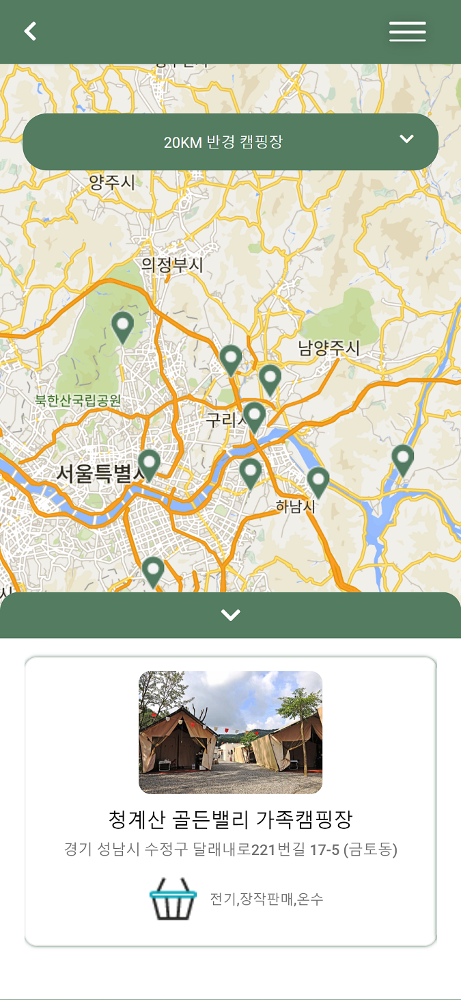

# Go! Camp Project

> 공공데이터 중 캠핑장 데이터와 Redux를 사용한 웹 사이트
> 

navigator.getCurrentPosition 함수를 이용해 현재 위치를 받아온 후

- 10km
- 20km
- 30km
- 40km
- 50km

의 거리를 설정해 주변에 있는 캠핑장을 Store에 저장 후 구글맵에 마커로 표시하고 각 캠핑장의 대략적인 정보를 표시해준다.

키워드를 검색해 키워드에 맞는 캠핑장을 Store에 저장 후 구글맵에 마커로 표시하고 각 캠핑장의 정보를 표시해준다. (현재는 한강을 검색함)

캠핑장의 정보를 클릭하게 되면 더 자세한 정보를 얻을 수 있도록 했다.

## Getting Started

- [Hosting Site](https://apiseop.site)

## Tech

### Front

- React
- CSS
- Javascript
- Redux
- Google Map API

### Back

- Spring Boot
- 공공데이터 API
